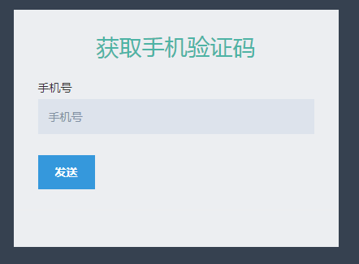
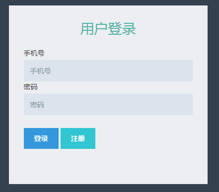
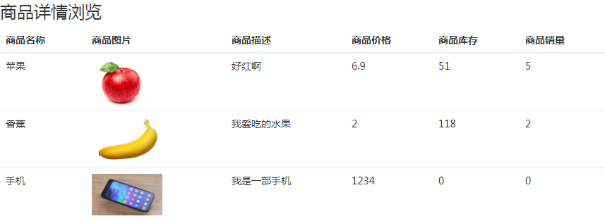
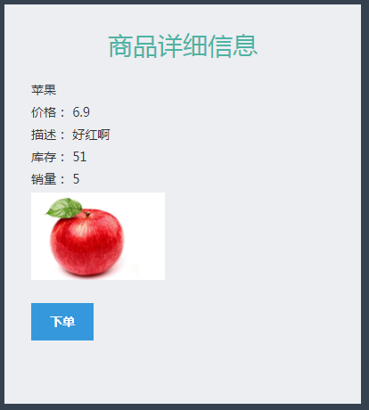

# Seconds kill System

Secondskill 是基于 SpringBoot 构建的秒杀系统，基本实现了从用户注册、登录，到商品展示，到订单管理，到商品秒杀的整个流程。


## 项目起源

来源于慕课网实战课程 [SpringBoot构建电商基础秒杀项目](http://www.imooc.com/learn/1079)，我尽可能保证与授课代码一致，在个别地方稍作修改。

> 如果刚开始看视屏就参考代码，会有很多地方不一致，是因为授课老师会在后期对代码不断优化。


## 技术选型

### 工具

- idea 2017

### 软件支持

- Java 8 （代码中使用到了lambda表达式）
- Mysql 5.7 （代码使用到了事务，需要存储引擎为InnoDB）

### 后端技术

- Spring-boot 1.5.2.RELEASE
- mysql-connector 5.1.22
- druid 1.1.3
- commons-lang3
- hibernate-validator

### 前端技术

- Metronic (使用到了该框架，不过主要用到css)
- jQuery
- HTML

## 项目运行

1. 确保已经启动了Mysql
2. 导入`seckill.sql`文件:`source seckill.sql`
3. 在idea中运行`App.class`

访问 http://localhost:9090/login.html 查看是否正常。

## 包结构

这个项目最令人激动就是这个包结构了，活脱脱一个**大型项目**的感觉。

```
secondkill
|- java
| App------------------------- 启动类
|   |- controller------------- 控制层，restful接口
|   |   |- viewobject--------- 控制层模型，用户前端显示
|   |- dao-------------------- 数据访问层，只有接口定义，代码由插件生成
|   |- dataobject------------- 数据层模型，代码由插件生成
|   |- error------------------ 统一错误处理
|   |- response--------------- 归一化结果集
|   |- service---------------- 服务层，只有接口定义
|   |   |- impl--------------- 服务层实现
|   |   |- model-------------- 服务层模型
|   |- util------------------- 工具类
|   |- validator-------------- 统一校验器
|- resources
|   |- mapping---------------- mybatis映射文件
|   |- static----------------- 前端代码
|   | application.yml--------- 配置文件
|   | mybatis-generator.xml--- mybatis生成器配置文件
|   | seckill.sql------------- 数据库文件
```

## 四大模块

### 用户模块

### 商品模块

### 交易模块

### 秒杀模块


## 成果展示

### 用户获取验证码

`http://localhost:9090/getotp.html`

### 用户注册

`http://localhost:9090/register.html`



### 用户登录

`http://localhost:9090/login.html`




### 商品列表展示

`http://localhost:9090/listitem.html`



### 商品详情

`http://localhost:9090/detail.html?id=3`



## 项目进展

目前该项目还没有完工，商品秒杀模块还在持续集成中。

## 项目思考

1. 该项目的分层思想可以直接运用到实际生产中
2. 用户模块花了很多心思在分表的处理，安全性考虑周密
3. 商品模块热点数据的处理思路
4. 订单模块处理流程，事务的处理
5. 秒杀模块需要对前期准备做大幅度修改，侵入性过高


